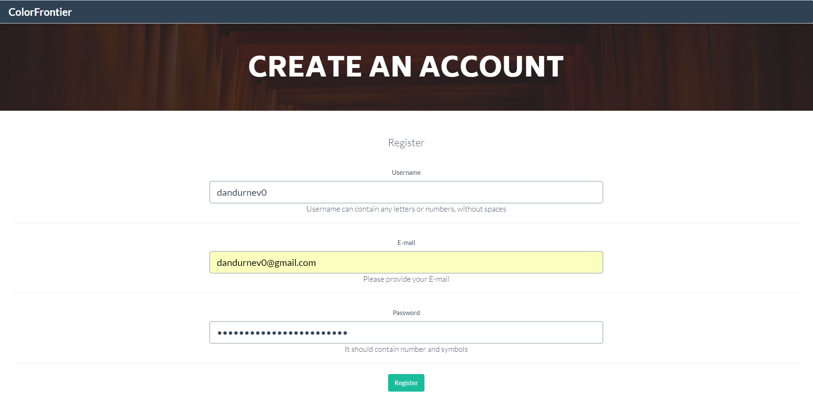
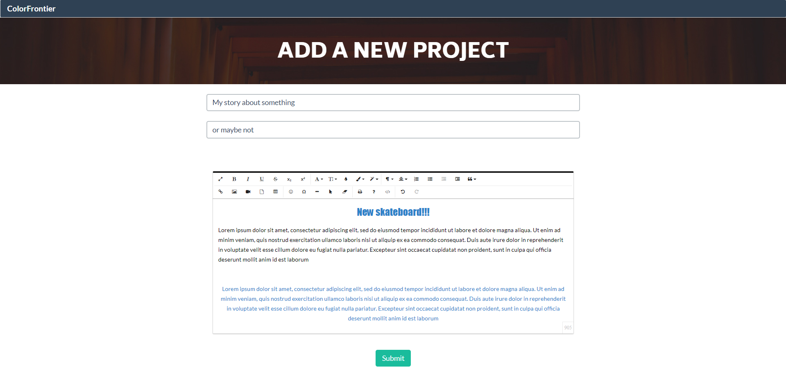
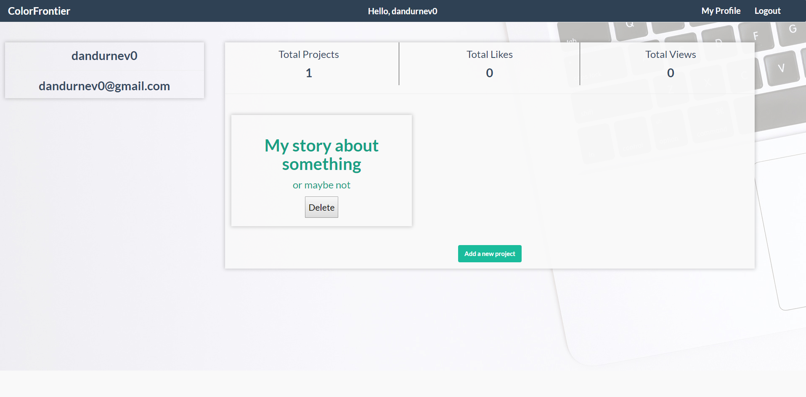
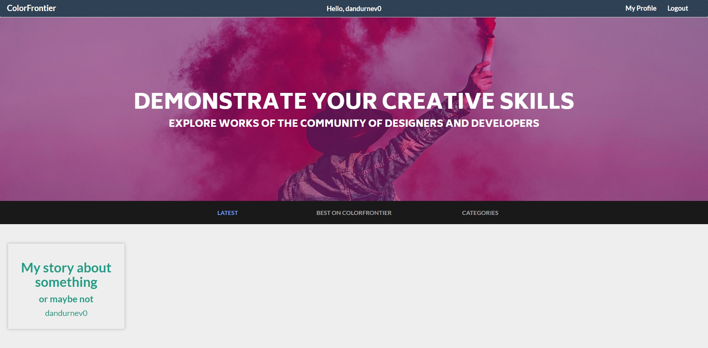

# ColorFrontier - spring web app for demonstrating your creative skills
This project was supposed to be something like [behance](https://www.behance.net/) but also with videos. But at the end it was just an example of Spring project.

Database path ---   ColorFrontier/src/main/java/com/colorfrontier/MainApp/db/   -- you can access it using MongoDBCompass. There will be all the data about the app. For now there are only user data (nickname, password, email, projects etc.). Download this 'db' folder and execute cmd command : mongod --dbpath=path to db folder. Then open MongoDBCompass and use default port 27017 to access it.

**This project is a great way to learn some common things in Spring. This code has register/login system using mongodb, I store every user in database, every project. It displays data only about exact person in their dashboard, displays each person's projects.**

**address: localhost:1337, don't forget to enable mongod before accessing this url**

ColorFrontier/src/main/java/com/colorfrontier/MainApp/  --- folder to all java files. Model files, Controllers, Services

ColorFrontier/src/main/resources/templates/   --- folder to all html files. They are divided into folders ( for example sections folder - contains all website sections like best projects, latest etc.)

# Contributing
Working on project together is awesome! I would really like it. It's really interesting for me to feel the working environment like on real job.
What is this project:
1. First of all, there is 'Controller' folder. There you can see all the controllers. They display different pages by @Getmapping and also execute different tasks by @Postmapping (for example after submitting registration form or login form).
2. db folder - install [MongoDB](https://www.mongodb.com/download-center?jmp=nav#community). Then open CMD and write : mongod --dbpath=path to db folder. It uses default 27017
3. Model folder - There are classes that describe app objects. For example **User.java** describes typical user. It has it's username, password, email etc. Same for **Project.java** - it's description, author etc.
4. Service folder - there are only MongoDB services. I mean files, that only work with MongoDB - register user(save to interface using Interface.save(new User()), and find user. Same for project, save, find.

Resources folder(not src) - has .html and .css files(also images). In Spring structure, I should have .html files in **templates** folder, and .css in **static** folder. But I also have .css files in templates folder to make creating site design easier(by opening .html page inn browser, not on localhost). I use [**Thymeleaf**](http://www.thymeleaf.org/) to display information about each user. This is already included in this project in **build.gradle**.

What am I planning to do: 
1. Sorting project to categories. I should add option to /addproject form(this option will have all the categories and user just chooses which he needs exactly). For now every project is only text. I want to add a possibility to add images, videos and maybe something else(like gif etc.). For this I need to create page where you can drag-and-drop elements to the page to make your project seem better. Then every project should have it's own page. Like on Youtube video. Not just preview, but the entire content.
2. Commenting other projects.
3. Like other projects.
4. And improve design.

I hope you're interested in taking part in development, maybe we will work on this together!

